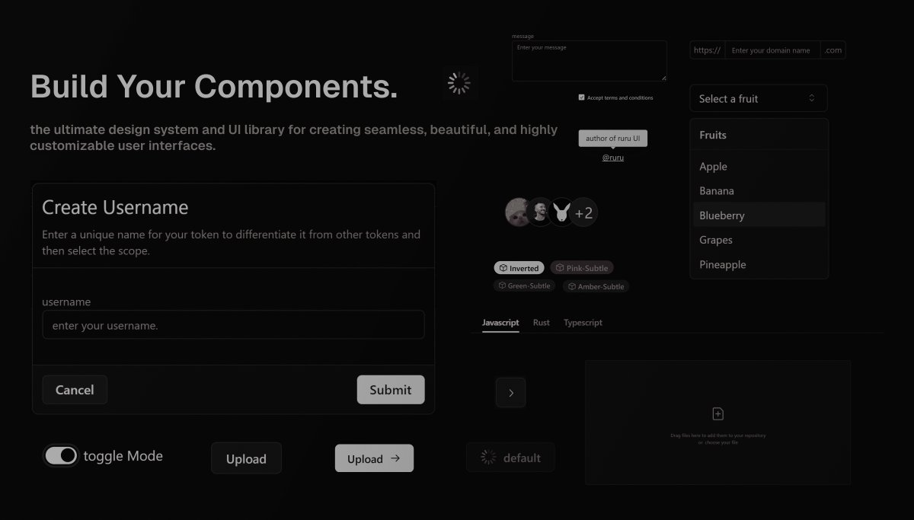

# Ruru-UI

> [!CAUTION]
> 🚧 I stopped maintaining this project a long time ago. I know it’s not that useful, polished, or impressive, but it still remains one of the best experiences I’ve had. I spent a lot of time and effort on it, and even though not every story has a happy ending, I can’t explain how much skill and knowledge I gained from it—it was totally worth it! This project may not count as one of my greatest achievements and might not provide much value on its own, but the skills and experience I earned from it are truly invaluable. ;D
> 
> 

---

Welcome to ruru UI, a comprehensive UI library and a set of reusable components designed to help you build beautiful and consistent user interfaces with ease.

## Join the Community

Become a part of the **ruru UI** community! Share your experiences, ask questions, and collaborate with other developers. Together, we can make **ruru UI** even better. [Provide feedback](https://github.com/ruru-m07/ruru-ui/discussions/3).

## License

**ruru UI** is licensed under the MIT License. You are free to use, modify, and distribute the library as you see fit. For more information, please refer to the [LICENSE](https://github.com/ruru-m07/ruru-ui/blob/main/LICENSE)

## Contributing

Contributions to Next.js are welcome and highly appreciated. However, before you jump right into it, we would like you to review our [Contribution Guidelines](https://github.com/ruru-m07/ruru-ui/blob/main/CONTRIBUTING.md) to make sure you have a smooth experience contributing to Next.js.

### Good First Issues:

We have a list of **[good first issues](https://github.com/ruru-m07/ruru-ui/labels/good%20first%20issue)** that contain bugs that have a relatively limited scope. This is a great place for newcomers and beginners alike to get started, gain experience, and get familiar with our contribution process.

## Thank You

Thank you for choosing **ruru UI**. We appreciate your support and look forward to seeing the amazing applications you build with our library. We hope you enjoy using **ruru UI** to build your applications. Our goal is to provide you with a robust and flexible set of tools to create stunning user interfaces.
